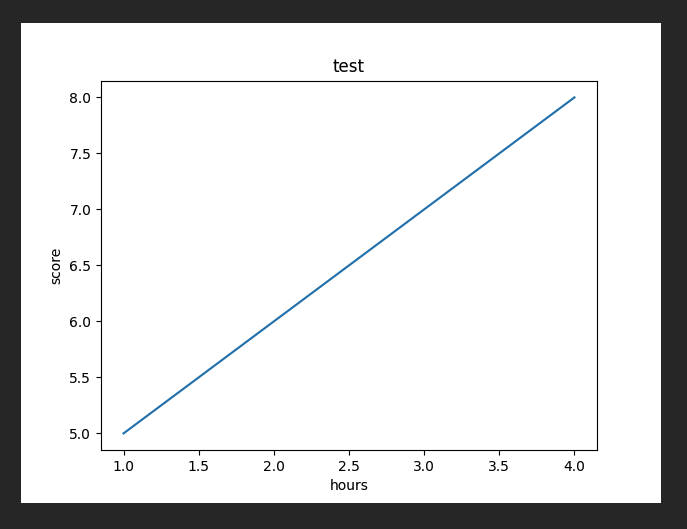

# Matplotlib 맷플롯립 설치 및 기본 문법 활용하기

## 📚 Matplotlib이란?

Matplotlib은 파이썬에서 데이터 시각화를 위해 사용되는 대표적인 라이브러리입니다.  
데이터를 차트나 플롯으로 그려서 시각적으로 표현할 수 있게 도와주며, 데이터 분석 이전에 데이터를 이해하거나, 분석 후 결과를 직관적으로 표현하는 데 유용합니다.

---

## 📚 설치 방법

Matplotlib을 사용하려면 먼저 라이브러리를 설치해야 합니다.  
Python 환경에서 아래 명령어를 통해 설치할 수 있습니다.

~~~bash
$ pip install matplotlib
~~~

설치가 완료되면, Python 코드에서 matplotlib을 import하여 사용할 수 있습니다.

~~~python
import matplotlib as mpl
print(mpl.__version__)  # Matplotlib 버전 정보 확인
~~~

---

## 📚 라인 플롯 그리기

라인 플롯은 연속된 데이터를 시각화할 때 유용합니다.

~~~python
import matplotlib.pyplot as plt

plt.title('test')  # 플롯의 제목 추가
plt.plot([1, 2, 3, 4], [5, 6, 7, 8])  # x축, y축 값
plt.show()  # 플롯을 화면에 표시
~~~

위 코드는 x축 값 [1, 2, 3, 4]와 y축 값 [5, 6, 7, 8]을 사용하여 간단한 라인 플롯을 그립니다.

---

## 📚 축 레이블 삽입하기

차트나 플롯에 축 레이블을 추가하면 데이터를 더욱 명확하게 이해할 수 있습니다.  
`xlabel()`과 `ylabel()`을 사용하여 x축과 y축에 레이블을 추가할 수 있습니다.

~~~python
import matplotlib.pyplot as plt

plt.title('test')  # 플롯의 제목
plt.plot([1, 2, 3, 4], [5, 6, 7, 8])  # x축, y축 값
plt.xlabel('hours')  # x축 레이블
plt.ylabel('score')  # y축 레이블
plt.show()
~~~

이 코드는 x축에 'hours', y축에 'score'라는 레이블을 추가합니다.

---

## 📚 새로운 라인 추가와 범례 삽입하기

플롯에 여러 개의 라인을 추가하거나 범례(legend)를 삽입할 수 있습니다.  
예를 들어, 두 개의 라인을 그려서 비교하거나 각 라인에 대한 설명을 추가할 수 있습니다.

~~~python
import matplotlib.pyplot as plt

plt.title('test')  # 플롯의 제목
plt.plot([1, 2, 3, 4], [5, 6, 7, 8])  # 첫 번째 라인
plt.plot([1, 1.5, 3, 3.5], [5, 6, 7, 8])  # 두 번째 라인
plt.xlabel('hours')  # x축 레이블
plt.ylabel('score')  # y축 레이블
plt.legend(['A', 'B'])  # 범례 추가
plt.show()
~~~

위 코드에서 두 번째 `plt.plot()`을 통해 새로운 라인을 추가하고, `plt.legend()`를 사용하여 범례에 'A'와 'B'를 각각 지정하여 두 라인을 구분할 수 있습니다.

